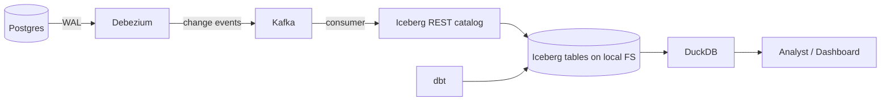

# Architecture — lakehouseit

## High-level flow



## Services in docker-compose

| Service | Image | Purpose |
|---|---|---|
| `postgres` | postgres:16 | Source database |
| `debezium` | debezium/connect:2.x | CDC publisher |
| `kafka` | confluentinc/cp-kafka:7.x | Event stream |
| `iceberg-rest` | apache/iceberg-rest-fixture:latest | REST catalog |
| `dbt` | ghcr.io/dbt-labs/dbt-duckdb:latest | Transformations |
| `duckdb` | duckdb/duckdb:latest | Query layer |

## dbt project layout

```
dbt/
├── dbt_project.yml
├── profiles.yml             # DuckDB connection against Iceberg
└── models/
    ├── bronze/              # raw 1:1 reflection of source tables
    │   ├── bronze__users.sql
    │   └── bronze__events.sql
    ├── silver/              # cleaned + typed + joined
    │   ├── silver__user_events.sql
    │   └── silver__subscriptions.sql
    └── gold/                # business metrics
        ├── gold__dau.sql
        ├── gold__churn_cohort.sql
        └── gold__mrr.sql
```

## Sample seed data — synthetic SaaS schema

```sql
CREATE TABLE users (id UUID PRIMARY KEY, email TEXT, signup_at TIMESTAMP, plan TEXT);
CREATE TABLE orgs (id UUID PRIMARY KEY, name TEXT, owner_id UUID REFERENCES users(id));
CREATE TABLE events (id UUID PRIMARY KEY, user_id UUID, org_id UUID, event_name TEXT, occurred_at TIMESTAMP, props JSONB);
CREATE TABLE subscriptions (id UUID PRIMARY KEY, org_id UUID, plan TEXT, started_at TIMESTAMP, ended_at TIMESTAMP, mrr_usd NUMERIC);
```

`scripts/seed.sh` generates ~100K rows distributed realistically (Pareto user activity, monthly churn cohorts, MRR drift over 12 months).

## Why these choices

| Choice | Rationale |
|---|---|
| **Iceberg over Delta / Hudi** | Iceberg won the lakehouse war in 2025–26; broadest catalog and engine support |
| **DuckDB as query layer** | Free, fast on local Iceberg, runs in browser via WASM for the playground |
| **dbt-duckdb adapter** | Single binary, no JVM, fast dev cycle |
| **Synthetic data, not real public datasets** | Realistic schema shape (multi-table, realistic cardinalities); avoid public-dataset licensing oddities |
| **Free-tier only** | Hosted demo runs without payment; users can fork without surprise costs |
```
